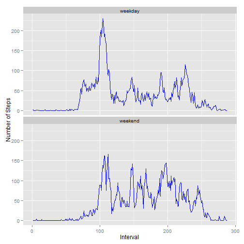

# Assignment : Peer Assessment 1
## Coursera Course : Reproducible Research

Load the data into R and look at the structre of the data

```r
data <- read.csv("activity.csv")
str(data)
```

```
## 'data.frame':	17568 obs. of  3 variables:
##  $ steps   : int  NA NA NA NA NA NA NA NA NA NA ...
##  $ date    : Factor w/ 61 levels "2012-10-01","2012-10-02",..: 1 1 1 1 1 1 1 1 1 1 ...
##  $ interval: int  0 5 10 15 20 25 30 35 40 45 ...
```

Now, let us look a the research questions and see how we can answer them using the above data

### Question set 1 : What is mean total number of steps taken per day?

1. Make a histogram of the total number of steps taken each day

```r
totalStepsPerDay <- aggregate(steps~date,data=data,sum)

hist(totalStepsPerDay$steps,xlab="Total No of steps taken / Day",main="Histogram of the total number of steps taken each day",breaks=40)
```

 

2. Calculate and report the mean and median total number of steps taken per day  

Mean total number of Steps taken per day

```r
mean(totalStepsPerDay$steps,na.rm=T)
```

```
## [1] 10766
```


Median total number of steps taken per day

```r
median(totalStepsPerDay$steps,na.rm=T)
```

```
## [1] 10765
```

### Question set 2: What is the average daily activity pattern?

1. Make a time series plot (i.e. type = "l") of the 5-minute interval (x-axis) and the average number of steps taken, averaged across all days (y-axis)

```r
avgStepsTakenPerInterval <- aggregate(steps~interval,data=data,FUN=mean)
plot(avgStepsTakenPerInterval, type = "l",xlab="5-Minute Interval",ylab="Average Number of Steps taken across all days")
```

 

2. Which 5-minute interval, on average across all the days in the dataset, contains the maximum number of steps?

```r
avgStepsTakenPerInterval[which.max(avgStepsTakenPerInterval$steps),]
```

```
##     interval steps
## 104      835 206.2
```
Interval 835 contains the maximum number of steps taken (~207 steps) across all days

### Question set 3: Imputing missing values

Calculate and report the total number of missing values in the dataset (i.e. the total number of rows with NAs)

```r
sum(is.na(data))
```

```
## [1] 2304
```

[Devise a strategy for filling in all of the missing values in the dataset. The strategy does not need to be sophisticated. For example, you could use the mean/median for that day, or the mean for that 5-minute interval, etc.
Create a new dataset that is equal to the original dataset but with the missing data filled in.]

Since for a given day with NA values, all the intervals for that day have NA's, I am using the mean of 5-minute interval to impute NA values.

I  have used the following approach to impute the missing values  
* Calcululate the Mean Steps per Interval using aggregate function  
* Copy the dataset with NA values to a new dataset  
* Convert the interval in the new dataset to factors  
* Replace the NA values in the new data with the Mean Steps per Interval calculated in the previous step  


```r
meanPerInterval <- aggregate(steps~interval,data=data,mean)
data.new <- data
data.new$interval <- factor(data.new$interval)
missingSteps <- is.na(data.new$steps)
data.new[missingSteps,"steps"] <- meanPerInterval[data.new[missingSteps,"interval"],"steps"]
```

Check that there are no NA values in the imputed dataset.

```r
sum(is.na(data.new$steps))
```

```
## [1] 0
```

Make a histogram of the total number of steps taken each day and Calculate and report the mean and median total number of steps taken per day. 


```r
totalStepsPerDay2 <- aggregate(steps~date,data=data.new,sum)

hist(totalStepsPerDay2$steps,xlab="Total No of steps taken / Day",main="Histogram of the total number of steps taken each day")
```

 

Mean total number of Steps taken per day

```r
mean(totalStepsPerDay2$steps)
```

```
## [1] 10766
```


Median total number of steps taken per day

```r
median(totalStepsPerDay2$steps)
```

```
## [1] 10766
```

Do these values differ from the estimates from the first part of the assignment? What is the impact of imputing missing data on the estimates of the total daily number of steps?

Mean and Median values from the first part of the assignment

Mean total number of Steps taken per day

```r
mean(totalStepsPerDay$steps)
```

```
## [1] 10766
```


Median total number of steps taken per day

```r
median(totalStepsPerDay$steps)
```

```
## [1] 10765
```


By comparing the Median and Mean values from first part and second part ,we can see that there is no change in the Mean but there is a slight change in the median.  
Overall we can say there there is no significant impact of imputing missing data on the estimates of the total daily number of steps given that the impute method used was the mean of 5-minute interval


### Question set 4: Are there differences in activity patterns between weekdays and weekends?


1. Create a new factor variable in the dataset with two levels – “weekday” and “weekend” indicating whether a given date is a weekday or weekend day.


```r
data.new$dayType <- as.factor(weekdays(as.Date(data.new$date)))
levels(data.new$dayType) <- c("weekday","weekday","weekend","weekend","weekday","weekday","weekday")
```

Look at the structure of the new variable and some data

```r
str(data.new$dayType)
```

```
##  Factor w/ 2 levels "weekday","weekend": 1 1 1 1 1 1 1 1 1 1 ...
```

```r
head(data.new[,c(2,4)])
```

```
##         date dayType
## 1 2012-10-01 weekday
## 2 2012-10-01 weekday
## 3 2012-10-01 weekday
## 4 2012-10-01 weekday
## 5 2012-10-01 weekday
## 6 2012-10-01 weekday
```


2. Make a panel plot containing a time series plot (i.e. type = "l") of the 5-minute interval (x-axis) and the average number of steps taken, averaged across all weekday days or weekend days (y-axis). 


Aggregate the data to calculate the average number of steps taken, averaged across day type


```r
avgStepsPerDaytype <- aggregate(steps~interval+dayType,data=data.new,mean)
```

Create the plot object and plot the graph

```r
library(ggplot2)
g <- ggplot(data=avgStepsPerDaytype,aes(as.numeric(interval),steps))
g+geom_line(color="blue") + facet_wrap(~dayType,ncol=1) +labs(x="Interval",y="Number of Steps")
```

 


